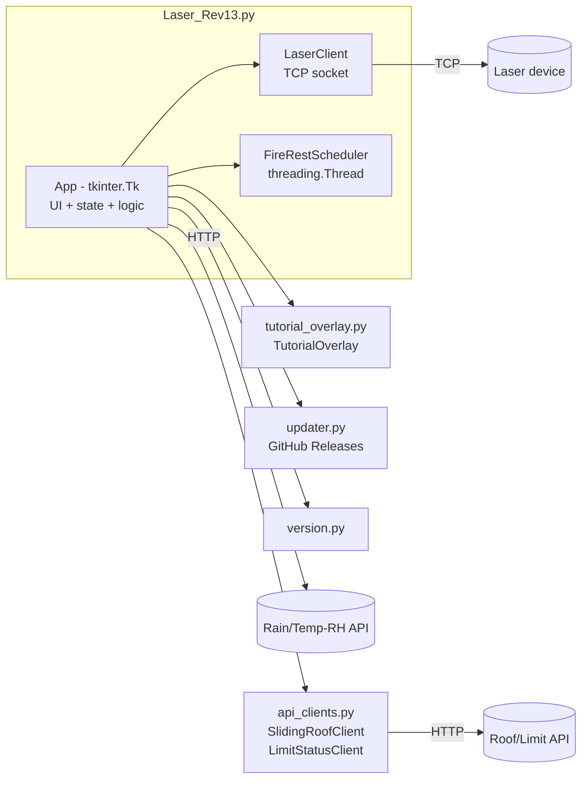

# Development Guide — Laser Control (Rev13)

เอกสารสำหรับนักพัฒนา: สถาปัตยกรรม, โมดูล, logic สำคัญ, การ build/test/release

---

## 1. ภาพรวมสถาปัตยกรรม



เทคโนโลยี: **Python 3.12 + Tkinter (ttk) + matplotlib + requests**
รูปแบบ: single-file GUI app (`Laser_Rev13.py`) + โมดูลเสริมข้าง ๆ

---

## 2. โมดูล / ไฟล์หลัก

| ไฟล์ | หน้าที่ |
|------|---------|
| `Laser_Rev13.py` | แอปหลัก — class `App`, `LaserClient`, `FireRestScheduler` |
| `api_clients.py` | HTTP client ควบคุมหลังคา (`SlidingRoofClient`) + อ่าน limit (`LimitStatusClient`) |
| `tutorial_overlay.py` | คู่มือ overlay (วงกลม + กล่องคำอธิบาย) |
| `updater.py` | เช็ค/ดาวน์โหลด/ติดตั้งอัปเดตจาก GitHub Releases |
| `version.py` | เลขเวอร์ชัน (แหล่งเดียว — ใช้ทั้ง title + เทียบ update + installer) |
| `LaserControl.spec` | สคริปต์ PyInstaller (freeze เป็น .exe) |
| `installer.iss` | สคริปต์ Inno Setup (ห่อเป็น installer, per-user) |
| `.github/workflows/release-laser-control.yml` | CI: push tag → build → publish release |
| `test_Laser_Rev13.py` | เทสต์ safety interlock (roof/laser) |
| `test_updater.py` | เทสต์ logic เทียบเวอร์ชัน/เช็ค release |
| `archive/` | เวอร์ชันเก่าทั้งหมด (อ้างอิง ไม่ใช้งาน) |

---

## 3. คลาสหลัก

### `App(tk.Tk)`
หัวใจของโปรแกรม — ถือทั้ง UI, state, และ logic ความปลอดภัย
- **การเชื่อมต่อ:** `connect()`, `disconnect()`, `_send()` (async), `_send_standby_sync()`
- **ยิงมือ:** `cmd_fire()`/`_safe_fire()`, `cmd_standby()`, `cmd_stop()`
- **โปรแกรมตั้งเวลา:** `start_program()`, `stop_program()`, `add_program()`,
  `remove_program()` (+ `_reindex_after_remove()`), `compute_next_occurrence()`
- **หลังคา:** `roof_open()`, `roof_close()` (มี interlock), `_schedule_prefire_api()`,
  `_schedule_postrest_api()`, `_monitor_roof_during_fire()`, `_is_program_active()`
- **ความปลอดภัย:** `_guard_fire_by_roof()`, `_temp_monitor_tick()`, `_on_rain_started()`
- **อัปเดต:** `check_for_updates()`, `_run_update()`, `_shutdown_for_update()`
- **คู่มือ:** `_start_tutorial()` + `_tut_*` demo helpers

### `LaserClient`
TCP socket ไปเลเซอร์ — `send_cmd()` มี `threading.Lock` (thread-safe),
รองรับ multi-line response, drop echo

### `FireRestScheduler(threading.Thread)`
ตัวจับเวลารอบ FIRE/REST ในหนึ่งช่วงเวลา — callback `on_fire`/`on_rest`/`on_tick`,
หยุดด้วย `stop_event`; `count_fire_cycles()` (staticmethod) คำนวณจำนวนรอบ

---

## 4. Threading / State model

| Thread | หน้าที่ |
|--------|---------|
| Main (Tk) | UI + `after()` timers (temp/roof/rain/telemetry poll) |
| `runner` (ต่อโปรแกรม) | manager loop คำนวณรอบ + สร้าง FireRestScheduler |
| `FireRestScheduler` | จับเวลา FIRE/REST เรียก on_fire/on_rest |
| `RainPollThread` / worker | ดึงข้อมูลเซ็นเซอร์ (non-blocking) |
| `threading.Timer` | prefire (เปิดหลังคา) / postrest (ปิดหลังคา) |

**state สำคัญ (ผูกกับ index โปรแกรม):**
`_prefire_timers`, `_postrest_timers`, `_delayed_close_after_ids`,
`active_program_idx`, `tele_owner_idx` — ต้อง remap เมื่อลบโปรแกรม
(`_reindex_after_remove`)

**การซิงก์:** `manual_lock` คุม `is_firing`; UI update จาก thread อื่นต้องผ่าน `after(0, ...)`

---

## 5. Logic ความปลอดภัย (สำคัญมาก — แก้ด้วยความระวัง)

1. **Safety Fire** — `_guard_fire_by_roof()` บล็อก FIRE ถ้า Roof ≠ ON
   (ระงับ popup ขณะฝนตก)
2. **ปิดหลังคาต้องดับเลเซอร์ก่อน** — `roof_close()` เรียก `_send_standby_sync()`
   ก่อน `post_close` ทุกเส้นทาง (auto/manual/rain/delayed)
3. **ฝนตก → STOP** (ไม่ใช่ pause) — `_on_rain_started()` เรียก `stop_program()`
   เพื่อหยุด FireRestScheduler จริง
4. **อุณหภูมิเกิน → STANDBY + ปิดหลังคา** — `_temp_monitor_tick()` (hysteresis 0.3)
5. **หลังคาหลุดขณะยิง → STANDBY** — `_monitor_roof_during_fire()`
   (fail-safe N/A grace = `roof_na_grace_sec`)
6. **orphan timer guard** — prefire/postrest เช็ค `_is_program_active()`
   ณ เวลาทำงานจริง กันสั่งหลังคาหลังโปรแกรมหยุด

> ประวัติการแก้บั๊กเหล่านี้อยู่ใน git log และ changelog หัวไฟล์ `Laser_Rev13.py`

---

## 6. Build / Test / Release

### รัน dev
```bash
pip install -r requirements.txt
python Laser_Rev13.py
```

### เทสต์
```bash
python -m pytest -v
```

### Build .exe + installer (ในเครื่อง)
```bash
pip install pyinstaller
python -m PyInstaller --noconfirm --clean LaserControl.spec   # -> dist/LaserControl/
"C:\Program Files (x86)\Inno Setup 6\ISCC.exe" installer.iss  # -> installer_output/
```

### Release อัตโนมัติ (CI)
```bash
git tag v13.0.6
git push origin v13.0.6   # -> Actions build + publish release เอง
```
ดูรายละเอียด: [CI_RELEASE.md](../CI_RELEASE.md), [RELEASE.md](../RELEASE.md)

---

## 7. แนวทางเวอร์ชัน

- แก้เลขที่ **`version.py`** ที่เดียว (CI/installer sync ตาม tag ให้อัตโนมัติ)
- รูปแบบ `MAJOR.MINOR.PATCH`; GitHub tag = `v` + เลขนี้
- `updater.py` เทียบแบบ semantic (`parse_version`) — tag ต้องมากกว่าจึงจะอัปเดต

---

## 8. Convention

- ไฟล์ runtime (`setting/`, `logs/`) และ build (`dist/`, `build/`,
  `installer_output/`, `release_assets/`, `__pycache__/`) **ไม่เข้า git**
  (ดู `.gitignore`)
- repo เป็น **public** — ห้าม commit รหัสผ่าน/token/ข้อมูล sensitive
- เวอร์ชันเก่าเก็บใน `archive/` ไม่ลบ (อ้างอิงประวัติ)
