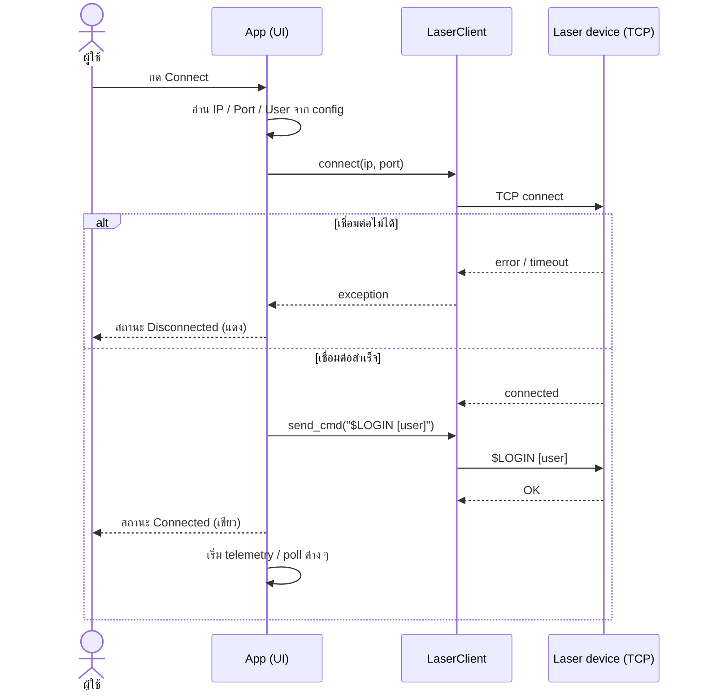
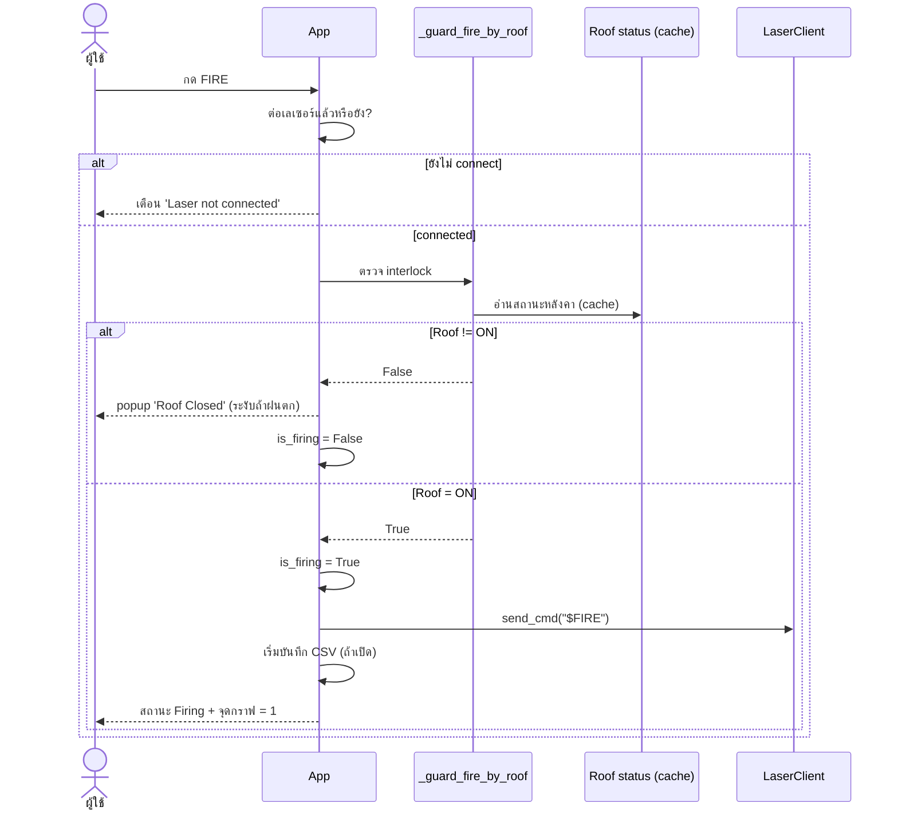
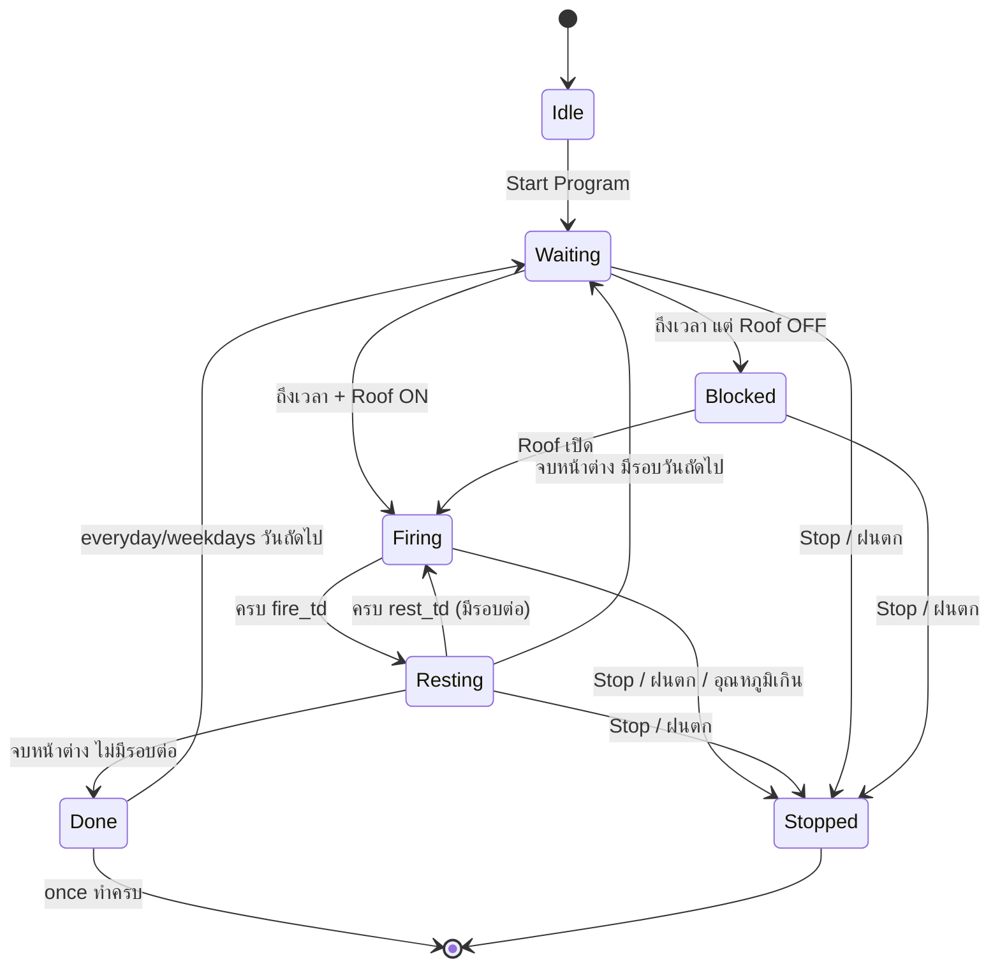
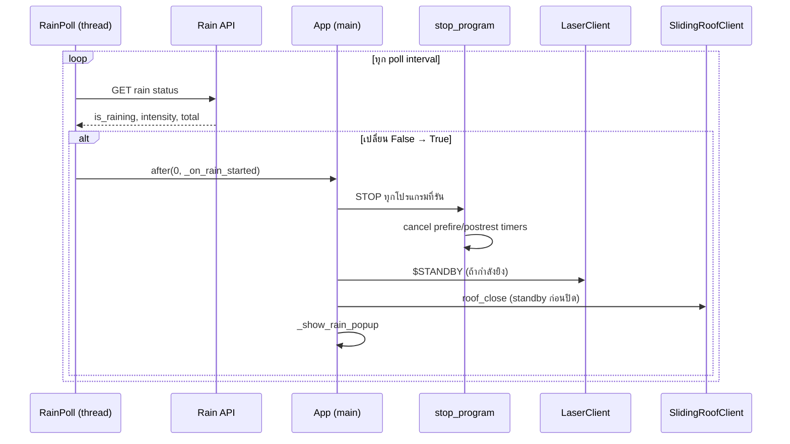
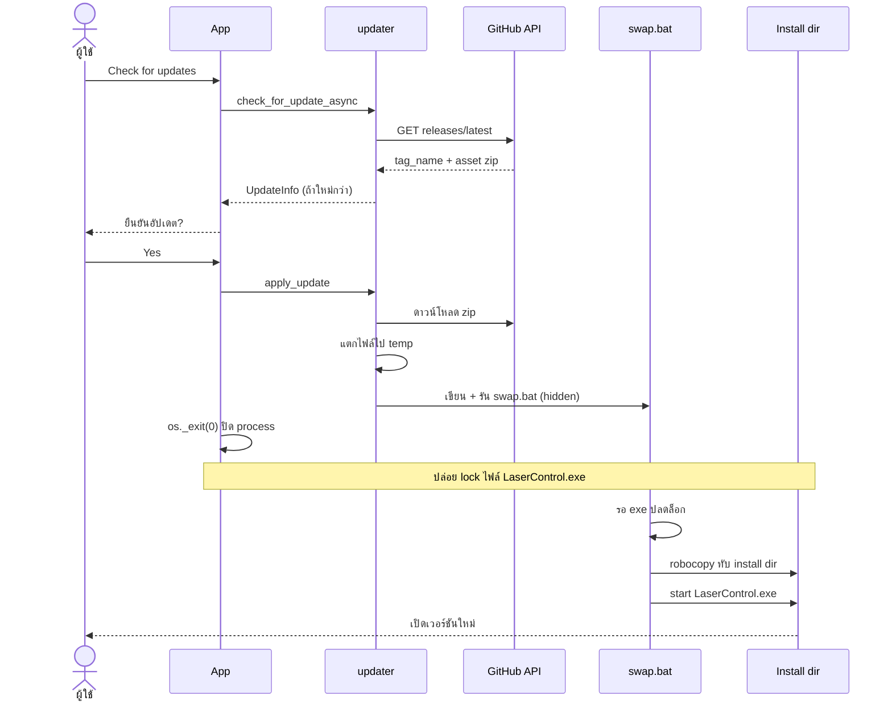
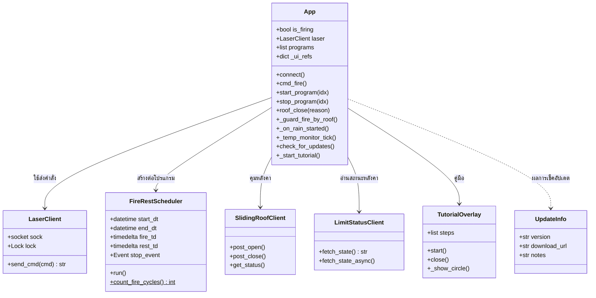
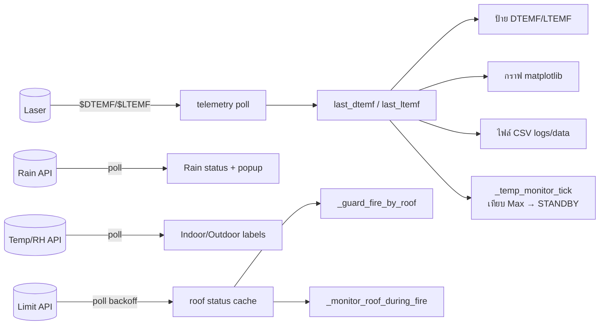

# Diagrams (เชิงลึก) — Laser Control (Rev13)

ไดอะแกรมเสริมแบบละเอียด: sequence, state machine, class, และ data flow
พร้อมคำอธิบายทีละส่วน (GitHub เรนเดอร์ Mermaid อัตโนมัติ)

สารบัญ
1. [Sequence — การเชื่อมต่อเลเซอร์](#1-sequence--การเชื่อมต่อเลเซอร์)
2. [Sequence — ยิงมือ (Manual FIRE) + Roof Interlock](#2-sequence--ยิงมือ-manual-fire--roof-interlock)
3. [State Machine — สถานะของโปรแกรมตั้งเวลา](#3-state-machine--สถานะของโปรแกรมตั้งเวลา)
4. [Sequence — ตรวจฝนตกและการตอบสนอง](#4-sequence--ตรวจฝนตกและการตอบสนอง)
5. [Sequence — อัปเดตอัตโนมัติ (swap-in-place)](#5-sequence--อัปเดตอัตโนมัติ-swap-in-place)
6. [Class Diagram — โครงสร้างคลาส](#6-class-diagram--โครงสร้างคลาส)
7. [Data Flow — Telemetry & Sensors](#7-data-flow--telemetry--sensors)

---

## 1. Sequence — การเชื่อมต่อเลเซอร์

**อธิบาย**
- การเชื่อมต่อเริ่มจากปุ่ม Connect → `App.connect()` อ่านค่าจาก config
  แล้วสร้าง TCP socket ผ่าน `LaserClient`
- ถ้าล้มเหลว (IP ผิด/เครื่องปิด/timeout) จะจับ exception และคง
  สถานะ **Disconnected** ไม่มีผลข้างเคียง
- เมื่อสำเร็จ ระบบส่งคำสั่ง login อัตโนมัติ (`$LOGIN [user]`) ตามรูปแบบที่ตั้งไว้
  แล้วเปลี่ยนสถานะเป็น **Connected**
- `send_cmd()` มี `threading.Lock` ภายใน จึงเรียกจากหลาย thread ได้ปลอดภัย
  (แต่ละคำสั่งไม่ทับกัน)

---

## 2. Sequence — ยิงมือ (Manual FIRE) + Roof Interlock

**อธิบาย**
- ก่อนยิงทุกครั้งต้องผ่าน **2 ด่าน**: (1) เชื่อมต่อแล้ว (2) หลังคาเปิด (Safety Fire)
- `_guard_fire_by_roof()` อ่านสถานะหลังคาจาก **cache** (ไม่ยิง API ตรงเพื่อไม่ให้ช้า)
  — cache มาจาก `_poll_roof_status()` ที่ดึงเป็นระยะ
- ถ้าหลังคาไม่เปิด จะบล็อกและเตือน (ยกเว้นตอนฝนตกจะไม่เด้ง popup เพราะเป็นเรื่องปกติ)
- เมื่อผ่านด่าน จึงตั้ง `is_firing = True` (ใต้ `manual_lock`) แล้วส่ง `$FIRE`
- `_safe_fire()` เป็น wrapper ที่ตรวจ interlock ซ้ำก่อนส่งคำสั่งจริง

---

## 3. State Machine — สถานะของโปรแกรมตั้งเวลา

**อธิบาย**
- **Idle** — ยังไม่เริ่ม (ค่าเริ่มต้น)
- **Waiting** — กด Start แล้ว รอถึงเวลาเริ่มของหน้าต่างเวลา (manager loop)
- **Firing / Resting** — วงจรหลักที่ `FireRestScheduler` สลับไปมาตาม `fire_td`/`rest_td`
- **Blocked** — ถึงเวลายิงแต่หลังคายังไม่เปิด → ไม่ยิง รอจนหลังคาเปิด
- **Done** — จบหน้าต่างเวลา; ถ้าโหมด everyday/weekdays จะกลับ **Waiting** รอวันถัดไป,
  ถ้า once จะจบ
- **Stopped** — ออกจากทุกสถานะได้ทันทีเมื่อ Stop Program / ฝนตก / อุณหภูมิเกิน
  (ตั้ง `manager_stop` + `oneshot_stop` หยุด scheduler จริง)
- **ไม่มี Paused** — ในเวอร์ชันนี้ตัดกลไก pause ออก ใช้ Start/Stop แทน

---

## 4. Sequence — ตรวจฝนตกและการตอบสนอง

**อธิบาย**
- การดึงข้อมูลฝนทำใน **background thread** (ไม่บล็อก UI) แล้วส่งงานกลับ main thread
  ผ่าน `after(0, ...)`
- ตรวจเฉพาะ **ขอบเปลี่ยน** False→True (ไม่ trigger ซ้ำทุก poll) — กัน popup เด้งรัว
  ด้วย cooldown 300s
- ลำดับความปลอดภัย: **STOP โปรแกรม → cancel timer หลังคา → STANDBY → ปิดหลังคา → popup**
  (เปลี่ยนจาก pause เป็น stop เพื่อให้ `FireRestScheduler` หยุดยิงจริง)
- หลังฝนหยุด สถานะกลับ No Rain แต่ **โปรแกรมไม่เริ่มเอง** — ผู้ใช้ต้องกด Start ใหม่

---

## 5. Sequence — อัปเดตอัตโนมัติ (swap-in-place)

**อธิบาย**
- `check_for_update()` เทียบ `tag_name` กับ `version.py` แบบ semantic;
  แยก 3 กรณี: มีอัปเดต / เป็นล่าสุด / เช็คไม่สำเร็จ (เน็ต)
- แอปที่กำลังรัน **ล็อกไฟล์ .exe ตัวเอง** จึง copy ทับไม่ได้ทันที — ต้องใช้
  `swap.bat` ที่ **รอ exe ปลดล็อก** แล้วค่อย `robocopy`
- `os._exit(0)` บังคับ process ตายทันที (ไม่ค้างจาก thread/matplotlib)
  เพื่อปล่อย lock ให้เร็ว — จุดนี้คือหัวใจที่ทำให้ copy สำเร็จ
- ทำงานเฉพาะ **.exe (frozen)**; ติดตั้งแบบ per-user จึงไม่ต้องสิทธิ์ admin

---

## 6. Class Diagram — โครงสร้างคลาส

**อธิบาย**
- **`App`** เป็นศูนย์กลาง ถือ state (`is_firing`, `programs`, `_ui_refs`) และ
  ประสานทุกโมดูล
- **`LaserClient`** ห่อ TCP socket — เมธอดเดียวหลักคือ `send_cmd()` (มี lock)
- **`FireRestScheduler`** ถูกสร้าง **หนึ่งตัวต่อหน้าต่างเวลาของโปรแกรม** —
  เป็น `threading.Thread`, `count_fire_cycles()` เป็น staticmethod (pure logic ทดสอบง่าย)
- **`SlidingRoofClient` / `LimitStatusClient`** (ใน `api_clients.py`) คุย HTTP กับ
  ระบบหลังคา แยกจากตรรกะ UI
- **`TutorialOverlay` / `UpdateInfo`** เป็นส่วนเสริม (คู่มือ / ผลการเช็คอัปเดต)

---

## 7. Data Flow — Telemetry & Sensors

**อธิบาย**
- ค่าอุณหภูมิเลเซอร์ (DTEMF/LTEMF) อ่านผ่าน telemetry แล้วเก็บใน cache
  (`last_dtemf`/`last_ltemf`) — จากนั้นแตกไปหลายปลายทาง: ป้าย, กราฟ, CSV,
  และตัวเฝ้าอุณหภูมิ
- **สำคัญ:** `_temp_monitor_tick` อ่านจาก cache นี้ — การจำลองอุณหภูมิใน tutorial
  จึง **ไม่แตะ cache** (แก้แค่ป้าย) เพื่อไม่ให้ trigger STANDBY จริง
- สถานะหลังคาอ่านแบบ **poll + backoff** (2→20s) เก็บใน cache แล้วใช้ทั้ง
  interlock ก่อนยิง และตัวเฝ้าระหว่างยิง
- เซ็นเซอร์ฝน/อุณหภูมิ-ความชื้น poll แยกกัน อัปเดต UI ผ่าน main thread
