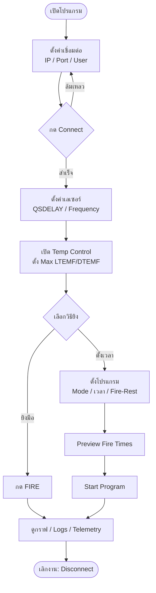
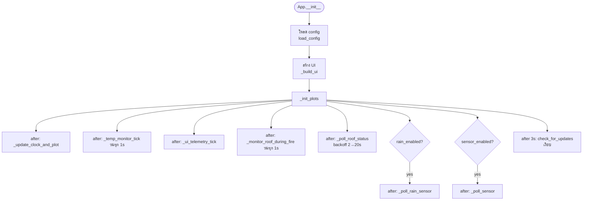
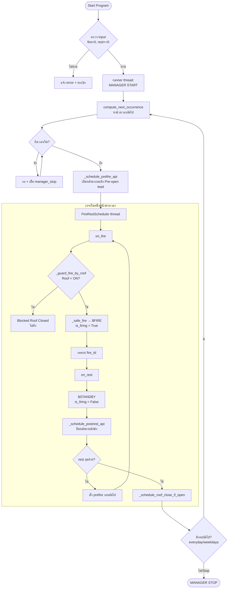
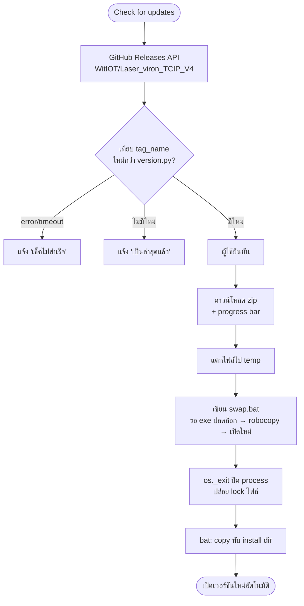

# Flow Chart — Laser Control (Rev13)

แผนภาพการทำงานของโปรแกรม (GitHub เรนเดอร์ Mermaid อัตโนมัติ)

---

## 1. ภาพรวมการใช้งาน (User Flow)

---

## 2. ลำดับเริ่มต้นโปรแกรม (Startup / Init)

---

## 3. โปรแกรมตั้งเวลา — วงจร Fire / Rest

> **หมายเหตุ interlock:** prefire/postrest timer ทุกตัวเช็ค `_is_program_active(idx)`
> ณ เวลาที่ทำงานจริง — ถ้าโปรแกรมถูกหยุด/ฝนตกไปแล้ว จะไม่สั่งเปิด/ปิดหลังคา

---

## 4. ระบบความปลอดภัย (Safety Interlocks)

```mermaid
flowchart TD
    subgraph RAIN[ฝนตก _on_rain_started]
      R1[ตรวจพบฝน False→True] --> R2[STOP ทุกโปรแกรมที่รัน<br/>stop_program + cancel timers]
      R2 --> R3[$STANDBY ถ้ากำลังยิง]
      R3 --> R4[ปิดหลังคา roof_close]
      R4 --> R5[popup Rain Detected<br/>ผู้ใช้ต้อง Start เองภายหลัง]
    end

    subgraph TEMP[อุณหภูมิเกิน _temp_monitor_tick วนทุก 1s]
      T1[DTEMF/LTEMF > Max?] -->|เกิน| T2[$STANDBY + is_firing=False]
      T2 --> T3[after 5s: ปิดหลังคา]
      T3 --> T4[popup Overheat พื้นแดง<br/>ค้างจนอุณหภูมิต่ำกว่า Max]
    end

    subgraph ROOFCLOSE[ปิดหลังคาขณะยิง roof_close]
      C1[สั่งปิดหลังคา] --> C2{is_firing?}
      C2 -->|ใช่| C3[_send_standby_sync<br/>ดับเลเซอร์ให้เสร็จก่อน]
      C3 --> C4[post_close ปิดหลังคา]
      C2 -->|ไม่| C4
    end

    subgraph MONITOR[หลังคาปิดเองขณะยิง _monitor_roof_during_fire]
      M1[Roof = OFF ขณะ is_firing?] -->|ใช่| M2[$STANDBY ทันที + เตือน]
    end
```

**หลักการ:** ทุกเส้นทางยึด "ดับเลเซอร์ก่อนเสมอ" — ปิดหลังคา/ฝน/อุณหภูมิ/หลังคาหลุด
จะสั่ง `$STANDBY` ก่อนทำอย่างอื่น

---

## 5. ระบบอัปเดตอัตโนมัติ (Auto-update)

> ทำงานเฉพาะเวอร์ชัน freeze (.exe); รันจาก source จะเช็คได้แต่ไม่ apply
> ติดตั้งแบบ per-user (%LOCALAPPDATA%) จึง copy ทับได้โดยไม่ต้องสิทธิ์ admin
