# Diagrams (PNG) — Laser Control (Rev13)

ภาพ PNG ของไดอะแกรมทั้งหมด (เอาไปใส่เอกสาร/สไลด์ได้เลย)
สร้างจากไฟล์ Mermaid ต้นฉบับใน [FLOWCHART.md](FLOWCHART.md) และ [DIAGRAMS.md](DIAGRAMS.md)

> วิธีสร้างใหม่: ติดตั้ง `npm i -g @mermaid-js/mermaid-cli` แล้วรัน
> `mmdc -i <file>.mmd -o <file>.png -b white -s 2 -w 1400`

## Flow Charts

### 1. ภาพรวมการใช้งาน
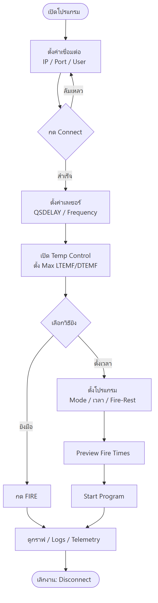

### 2. ลำดับเริ่มต้นโปรแกรม (Startup / Init)
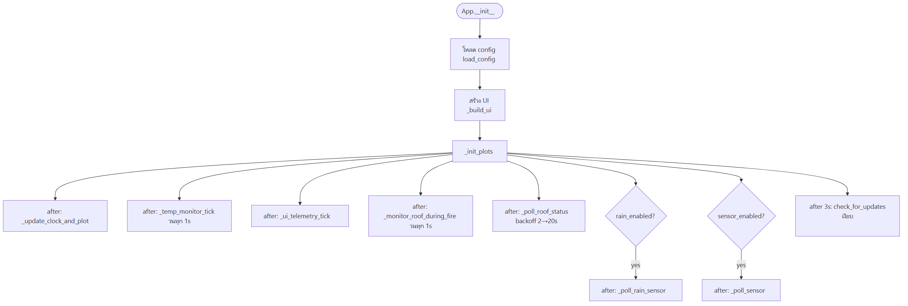

### 3. วงจร Fire / Rest
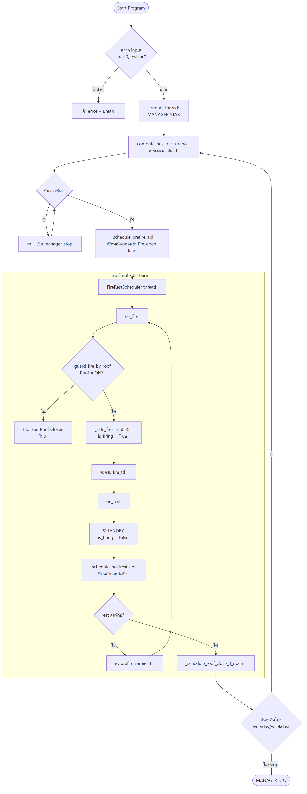

### 4. ระบบความปลอดภัย (Safety Interlocks)
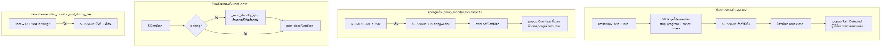

### 5. อัปเดตอัตโนมัติ
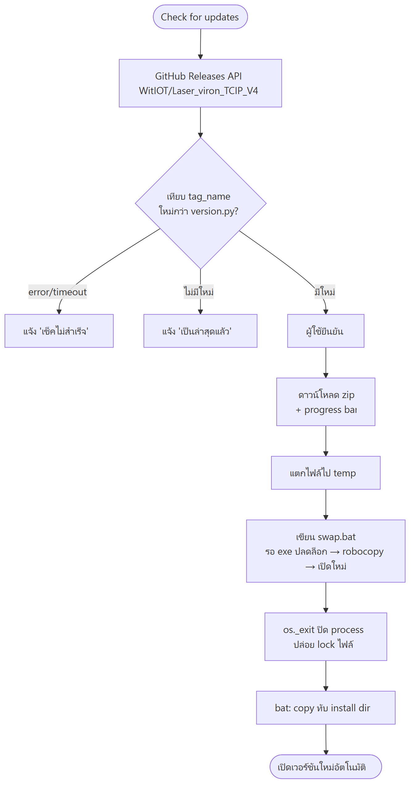

## Diagrams เชิงลึก

### 6. Sequence — การเชื่อมต่อเลเซอร์
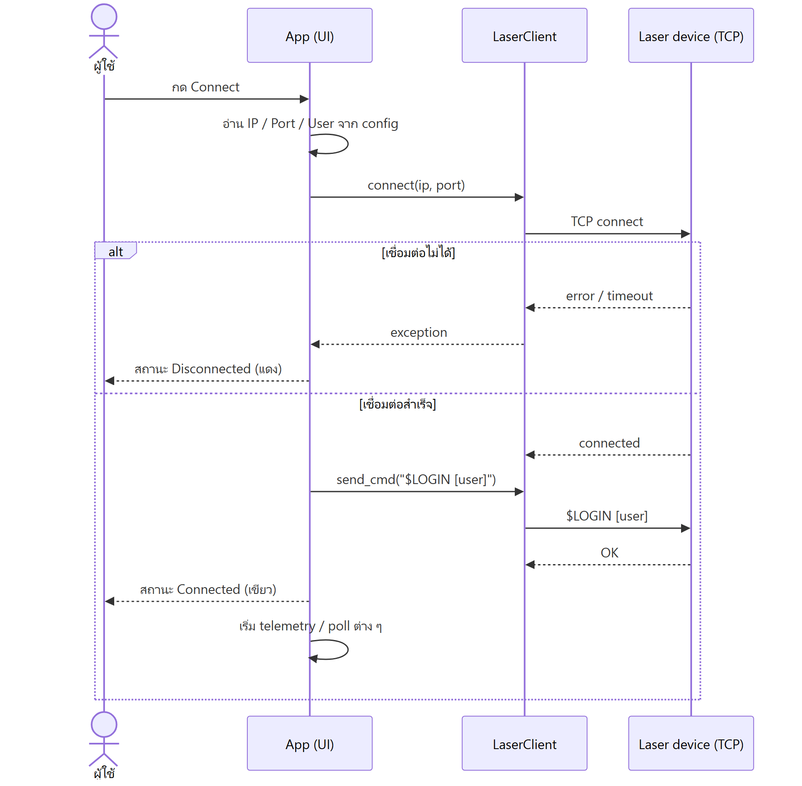

### 7. Sequence — ยิงมือ + Roof Interlock
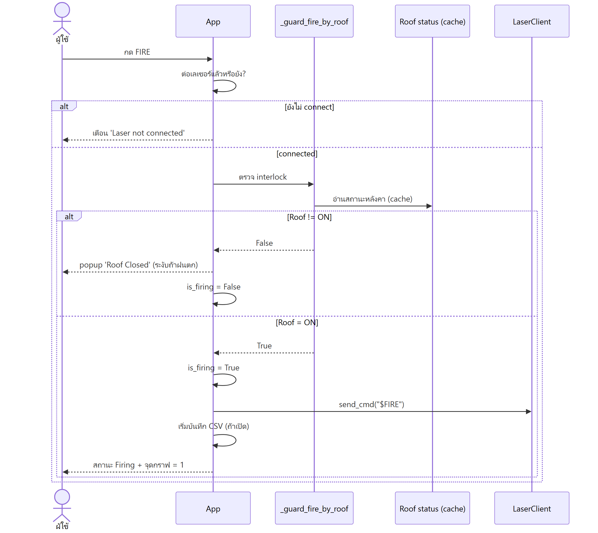

### 8. State Machine — สถานะโปรแกรม
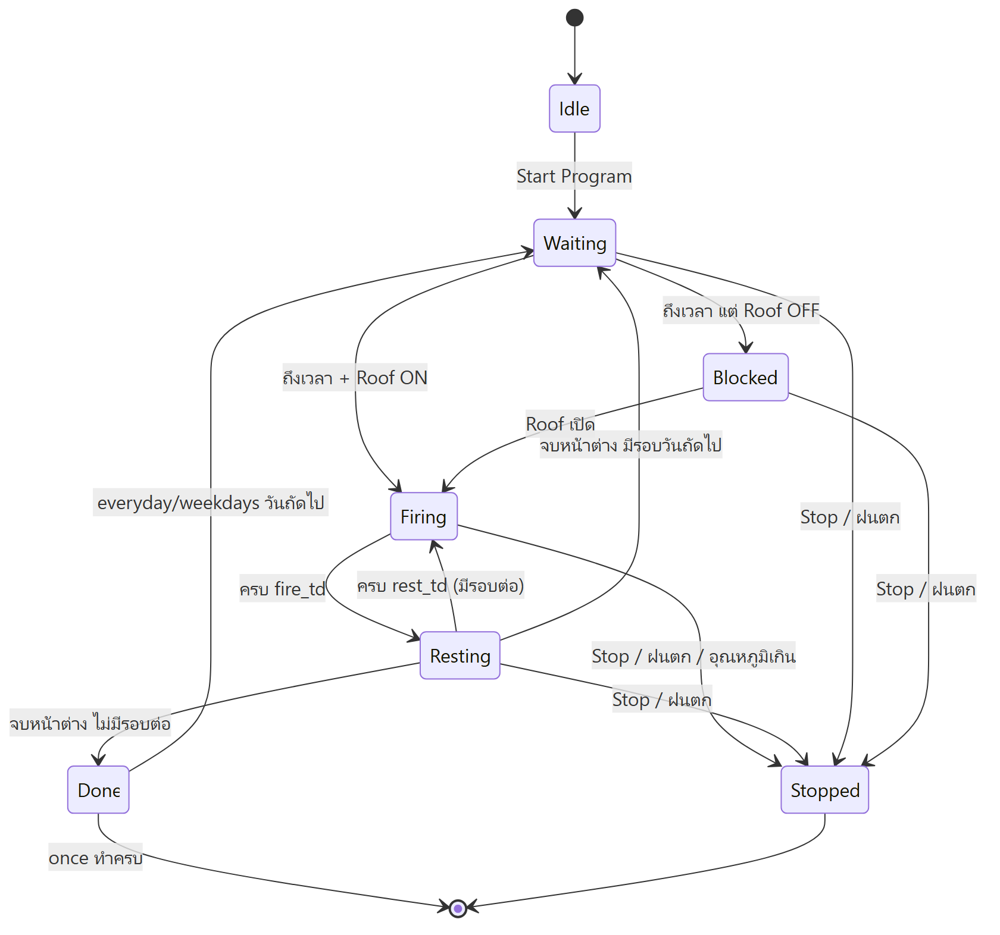

### 9. Sequence — ตรวจฝนตก
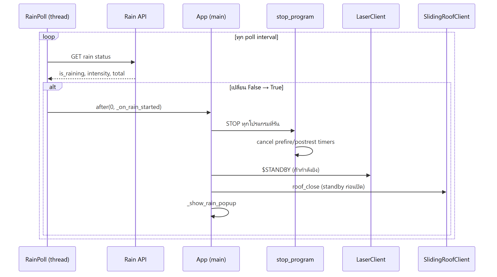

### 10. Sequence — อัปเดต (swap-in-place)
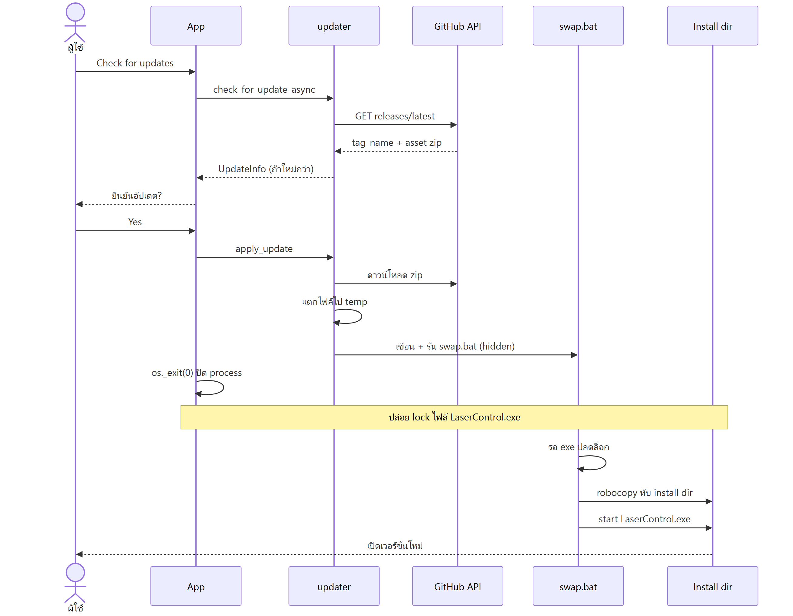

### 11. Class Diagram
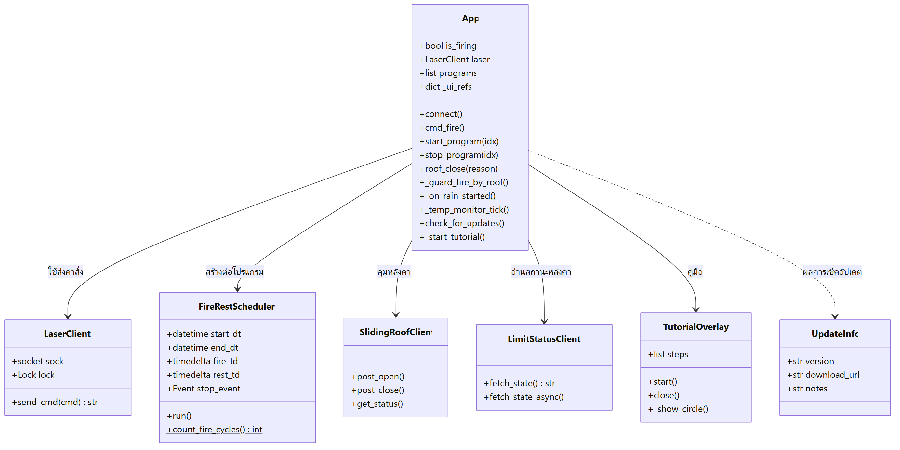

### 12. Data Flow — Telemetry & Sensors
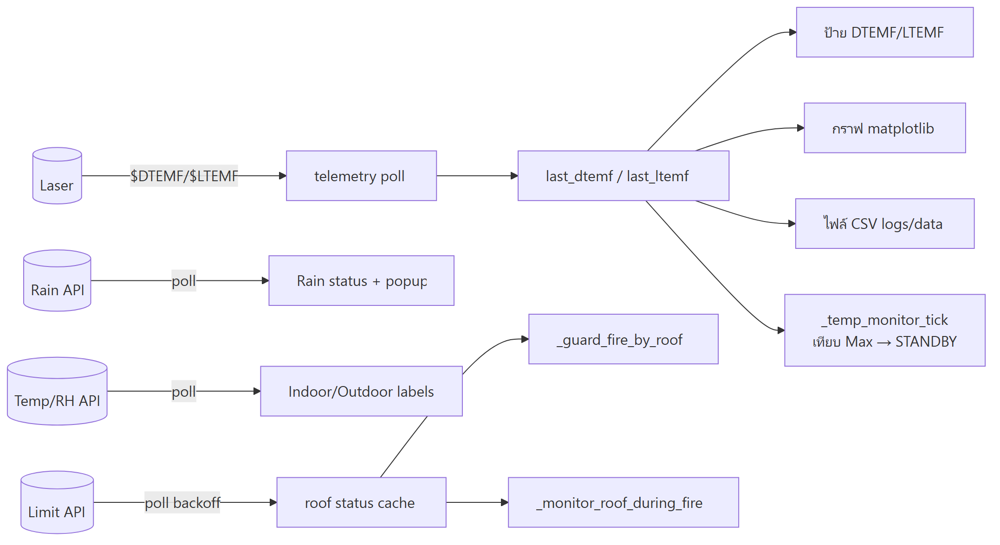

## Weather Protection & Safety Integration

### 13. ภาพรวมการผสานระบบป้องกันสภาพอากาศ
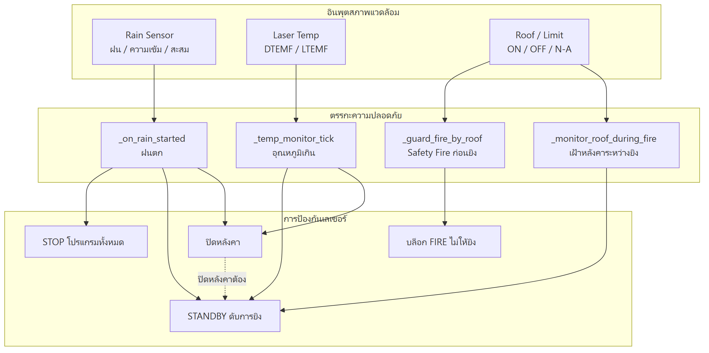

### 14. Rain Sensor — ลำดับ poll และตัดสินใจ
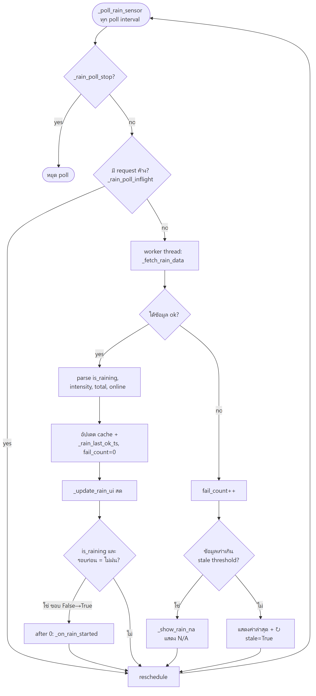

### 15. Rain Sensor — State Machine
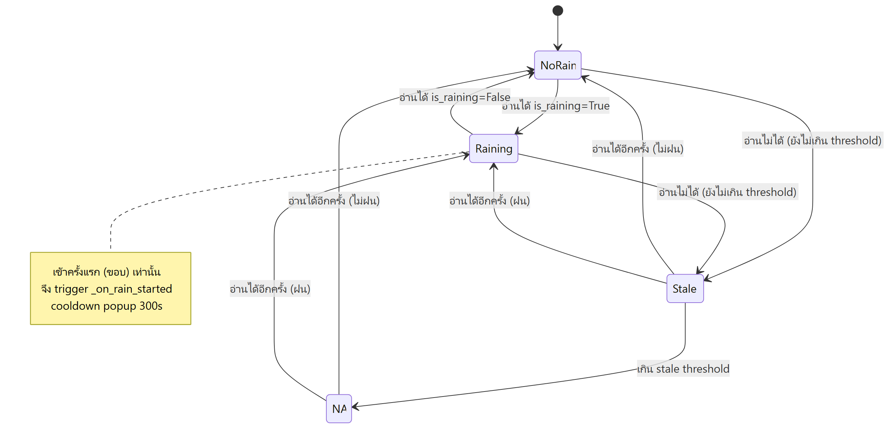

### 16. Rain Sensor — ลำดับเหตุการณ์เมื่อฝนตก
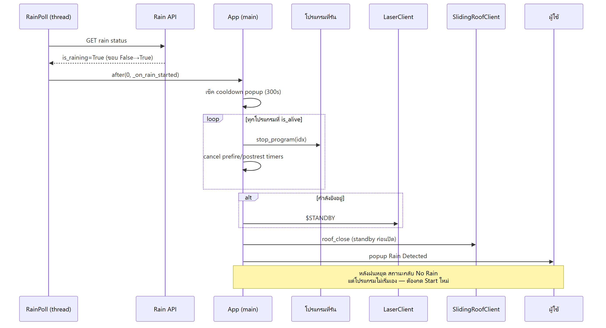
