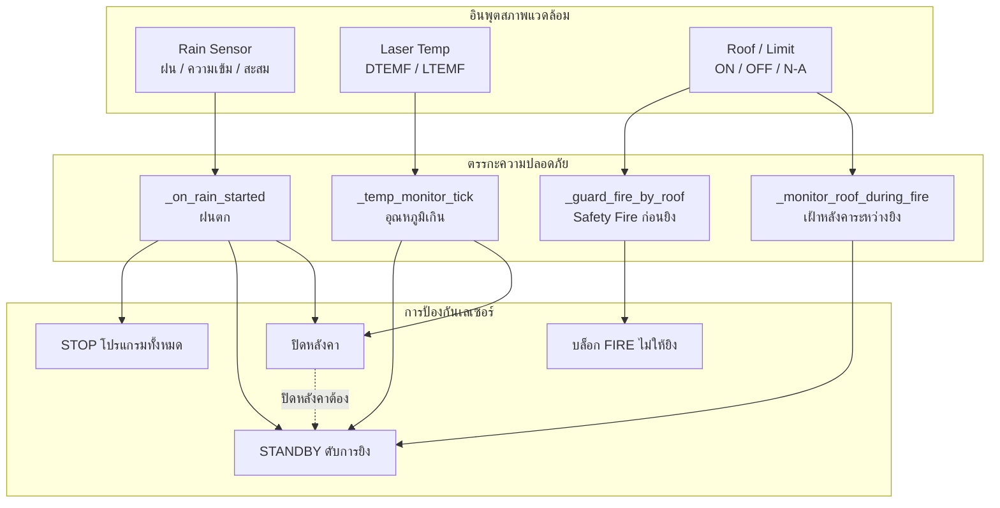
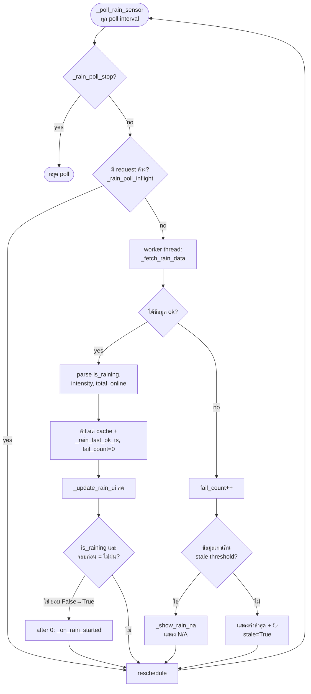
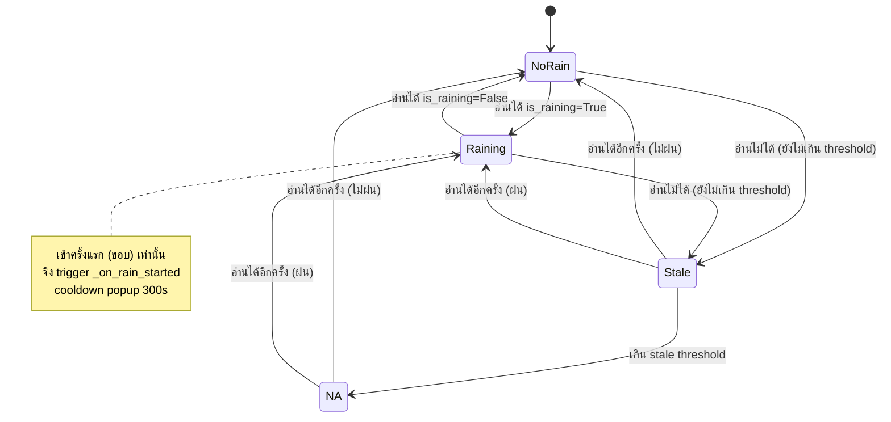
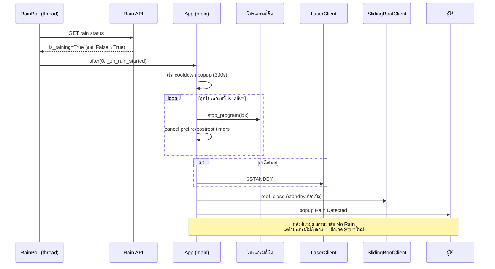

# Weather Protection & Safety Integration — Laser Control (Rev13)

เอกสารเฉพาะเรื่อง: การป้องกันสภาพอากาศ (ฝน/อุณหภูมิ/หลังคา) ผสานกับระบบความปลอดภัยเลเซอร์
และรายละเอียดของ Rain Sensor

สารบัญ
1. [ภาพรวมการผสานระบบป้องกันสภาพอากาศ](#1-ภาพรวมการผสานระบบป้องกันสภาพอากาศ)
2. [Rain Sensor — ลำดับการ poll และตัดสินใจ](#2-rain-sensor--ลำดับการ-poll-และตัดสินใจ)
3. [Rain Sensor — State Machine](#3-rain-sensor--state-machine)
4. [Rain Sensor — ลำดับเหตุการณ์เมื่อฝนตก (integration)](#4-rain-sensor--ลำดับเหตุการณ์เมื่อฝนตก-integration)
5. [ตารางสรุปการตอบสนอง](#5-ตารางสรุปการตอบสนอง)

---

## 1. ภาพรวมการผสานระบบป้องกันสภาพอากาศ

**หลักการผสานระบบ**
- อินพุตสภาพแวดล้อม 3 ทาง (ฝน / อุณหภูมิ / หลังคา) ป้อนเข้าตรรกะความปลอดภัย
  ที่ทำงานอิสระคู่ขนานกัน
- ทุกเส้นทางยึดหลัก **"ดับเลเซอร์ก่อนเสมอ"** — แม้แต่การปิดหลังคาก็ต้อง `$STANDBY`
  ก่อน (เส้นประ)
- **Safety Fire** (D3) เป็นด่านป้องกัน *ก่อน* ยิง; **roof monitor** (D4) เป็นด่าน
  *ระหว่าง* ยิง — สองชั้นเสริมกัน

---

## 2. Rain Sensor — ลำดับการ poll และตัดสินใจ

**อธิบาย**
- poll ทำใน **background thread** (`_fetch_rain_data`) ไม่บล็อก UI; มี guard
  `_rain_poll_inflight` กันยิงซ้อน
- **สำเร็จ:** อัปเดต cache + จอ, แล้วตรวจ **ขอบเปลี่ยน** ไม่ฝน→ฝน เพื่อสั่ง
  `_on_rain_started` เพียงครั้งเดียวต่อการเริ่มฝน (ไม่รัวทุก poll)
- **ล้มเหลว (เน็ต/timeout):** ไม่ลบค่าทันที — มี **grace period**; ถ้าเก่าเกิน
  `stale threshold` จึงแสดง **N/A**, ไม่งั้นแสดงค่าล่าสุดพร้อมเครื่องหมาย retry (↻)

---

## 3. Rain Sensor — State Machine

**อธิบาย**
- **NoRain / Raining** — สถานะปกติจากเซ็นเซอร์
- **Stale** — อ่านไม่ได้ชั่วคราว ยังแสดงค่าล่าสุด (มี ↻) กันจอกระพริบตอนเน็ตสะดุด
- **N/A** — อ่านไม่ได้นานเกิน `rain_stale_sec` → ถือว่าข้อมูลใช้ไม่ได้
- การเข้าสู่ **Raining จากขอบ** (ไม่ฝน→ฝน) เท่านั้นที่สั่ง safety actions;
  popup มี cooldown 300s กันเด้งซ้ำเมื่อเซ็นเซอร์รายงานกระตุก

---

## 4. Rain Sensor — ลำดับเหตุการณ์เมื่อฝนตก (integration)

**อธิบาย**
- ลำดับเป๊ะ: **STOP โปรแกรม → cancel timer หลังคา → STANDBY → ปิดหลังคา → popup**
- เปลี่ยนจาก pause เป็น **stop** เพื่อให้ `FireRestScheduler` หยุดยิงจริง
  (pause ไม่หยุด scheduler รอบปัจจุบัน)
- ยกเลิก prefire/postrest timer กัน "orphan timer" ไปสั่งเปิด/ปิดหลังคาเองภายหลัง
- ปลอดภัยแบบ fail-safe: การปิดหลังคาเรียก `roof_close()` ที่ `$STANDBY` ให้เสร็จก่อน

---

## 5. ตารางสรุปการตอบสนอง

| เหตุการณ์ | ตรวจโดย | STOP โปรแกรม | STANDBY | ปิดหลังคา | บล็อก FIRE | Popup |
|-----------|---------|:---:|:---:|:---:|:---:|:---:|
| ฝนตก | `_on_rain_started` | ✅ | ✅ | ✅ | — | ✅ Rain |
| DTEMF/LTEMF เกิน Max | `_temp_monitor_tick` | — | ✅ | ✅ (หลัง 5s) | — | ✅ Overheat |
| หลังคาไม่เปิด (ก่อนยิง) | `_guard_fire_by_roof` | — | — | — | ✅ | ✅ Roof Closed* |
| หลังคาปิดเอง (ระหว่างยิง) | `_monitor_roof_during_fire` | — | ✅ | — | — | ✅ Roof Closed |
| สั่งปิดหลังคาขณะยิง | `roof_close` | — | ✅ (ก่อนปิด) | ✅ | — | — |

\* ระงับ popup เมื่อฝนตก (เพราะหลังคาปิดเป็นเรื่องปกติของฝน)

**ค่าตั้งที่เกี่ยวข้อง** (แท็บ Settings/Config)
- Rain: `rain_api_url`, poll interval (แนะนำ 1–5s), stale threshold (`rain_stale_sec`)
- Roof: Pre-open lead (15s), Post-close delay (3–5s)
- Temp: Max LTEMF / Max DTEMF, hysteresis 0.3°C
